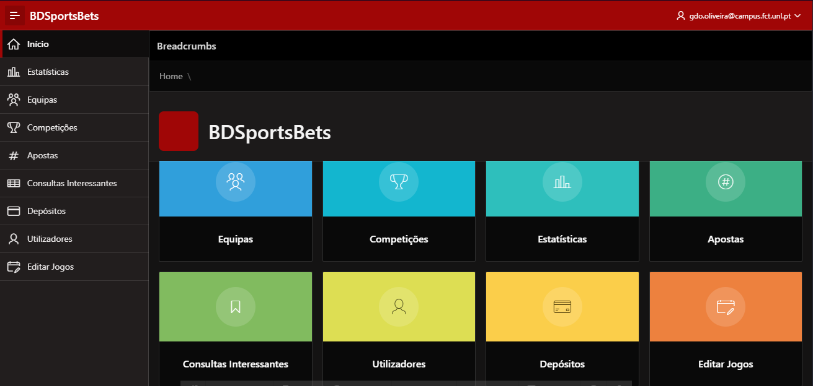
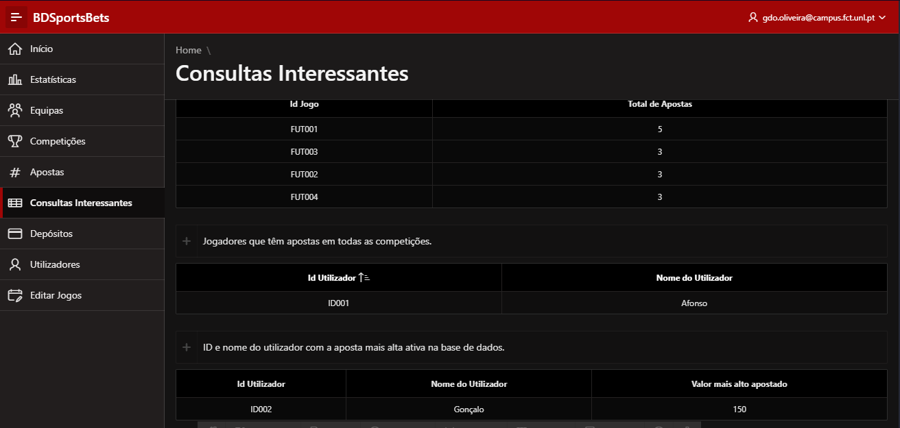
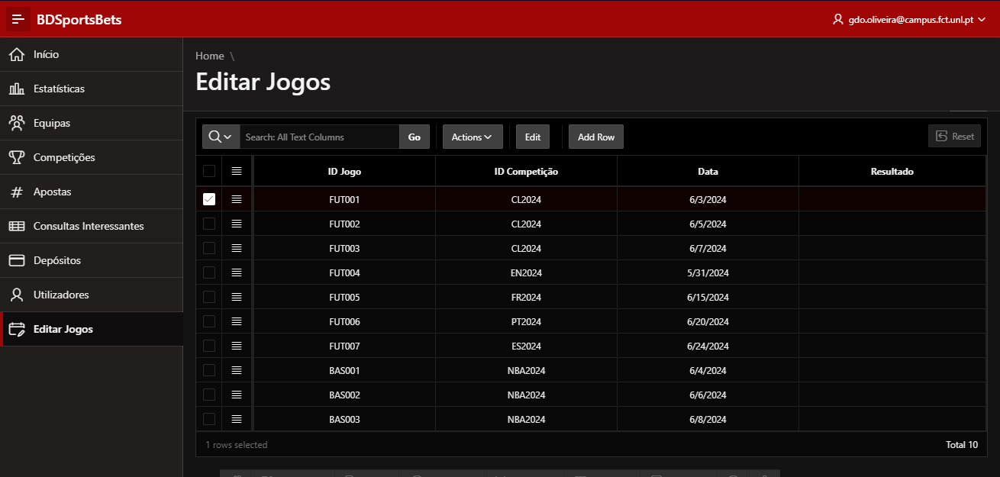

# Sports-Betting-DB
Oracle APEX application build implementing a created SQL database representing a somewhat basic platform that supports sports betting.

# Features
- Fully implemented and extendable APEX application.
- Modifiable reports for consulting the results of various queries such as existent teams, players, competitions, platform users, bets and some statistics.
- Supports the insertion of new users, bets and games through the interface altough SQL code is always editable.
- App fully navigable by cards, side menu and breadcrumbs.

# Application Screenshots

